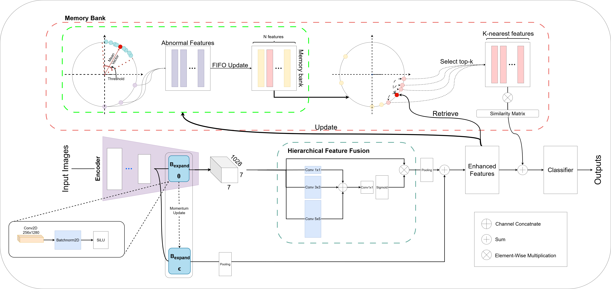

# CHARM-Xray: A Consistent Hybrid Attention Network with Rare Memory Bank for Multi-label Chest X-ray Classification

This repository contains the official implementation of the paper:

> **CHARM-Xray: A Consistent Hybrid Attention Network with Rare Memory Bank for Multi-label Chest X-ray Classification**

We propose CHARM-Xray, a novel architecture for multi-label CXR classification that addresses this imbalance through three key components: 
(1) a momentum-stabilized pathway that promotes feature consistency 
(2) a multi-scale feature fusion module that captures diverse spatial patterns
(3) an adaptive memory bank that retains discriminative features from rare pathologies.


---
## 🖼️ Model Overview



\begin{table}[h]
\centering
\caption{Comparison of hyperparameter settings with EfficientNetV2-S backbone.}
\label{tab:hyperparams_comparison}
\begin{tabular}{lcccc}
\hline
\textbf{Momentum} & \textbf{\textit{k}} & \textbf{Threshold} & \textbf{AUC} \\
\hline
0.99 & 2 & 0.05 & 0.8610 \\
 & 2 & 0.1 & 0.8677 \\
 & 2 & 0.2 & 0.8386 \\
 & 3 & 0.05 & 0.8384 \\
 & 3 & 0.1 & 0.8627 \\
 & 3 & 0.2 & 0.8495 \\
 & 4 & 0.05 & 0.8632 \\
 & 4 & 0.1 & 0.8617 \\
 & 4 & 0.2 & 0.8723 \\
 & 5 & 0.2 & \textbf{0.8752} \\
\hline
0.999 & 2 & 0.05 & 0.8497 \\
 & 2 & 0.1 & 0.8471 \\
 & 2 & 0.2 & 0.8665 \\
 & 3 & 0.05 & 0.8445 \\
 & 3 & 0.1 & 0.8564 \\
 & 3 & 0.2 & 0.8678 \\
 & 4 & 0.05 & 0.8570 \\
 & 4 & 0.1 & 0.8506 \\
 & 4 & 0.2 & 0.8445 \\
 & 5 & 0.1 & 0.8555 \\
 & 5 & 0.2 & 0.8568 \\
\hline
0.9999 & 2 & 0.1 & 0.8509 \\
 & 3 & 0.1 & 0.8568 \\
 & 4 & 0.1 & 0.8611 \\
 & 4 & 0.2 & 0.8708 \\
 & 5 & 0.1 & 0.8601 \\
\hline
\end{tabular}
\vspace{1mm}
\end{table}
---

## 📁 Project Structure

├── train.ipynb 

├── test.ipynb 

├── image.png # Model architecture or training pipeline illustration

└── README.md # This file

---

## ⚙️ Setup

- Platform: **Kaggle Notebooks**
- GPU: **P100** (enable in Notebook settings)
- Dependencies: Available in Kaggle by default (fastai, PyTorch, scikit-learn)

---

## 🚀 Training and Evaluation Instructions

### 🎯 Training Configuration

The training process in `train.ipynb` includes both phases (pre-training and fine-tuning) in a single notebook. You can adjust key hyperparameters as follows:

```python
# Define the parameter grid for training configuration
momentum_values = [0.99]
k_values = [2, 3, 4, 5]
threshold_values = [0.2]

# Example: Set config for training
momentum_values = [0.99]
k_values = [5]
threshold_values = [0.2]
# Pass config to your training function as needed
```

---

## ➕ Adding Custom Data to Kaggle

1. **Go to your Kaggle Notebook.**
2. On the right sidebar, click on **"Add data"**.
3. Search for a dataset or click **"Upload"** to add your own files.
4. After adding, access your data in the notebook under `/kaggle/input/data/`.

---

```python
# Load Stage 1 weights
learn = learn.load('')

# Fine-tune with Focal Loss
learn.unfreeze()
learn.fit_one_cycle(10, slice(2e-5, 8e-5))
```

### 🧪 3. Test and Evaluate the Model
Open `test-notebook.ipynb`:

```python
# Load Stage 2 weights
result = get_roc_auc(model_vgg_lka, 'stage2_model')

# Output ROC-AUC score
print("ROC-AUC Score:", result)
```
---
## 📌 Key Highlights
Stage 1 uses Binary Cross-Entropy Loss to learn abnormal's patterns.

Stage 2 uses Focal Loss to focus on hard and minority classes.

Combines VGG16 backbone with Large Kernel Attention (LKA) modules for better spatial representation.

Designed to handle class imbalance in multi-label medical imaging.

---
## 📜 License
This project is licensed under the MIT License.
Feel free to use, modify, and share with attribution.

---
## 📬 Contact
For questions, feedback, or collaborations, please open an issue on this repository.